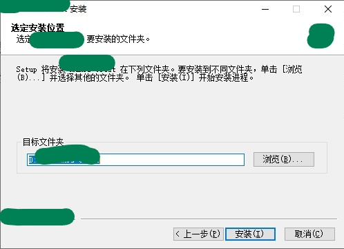

# 研究Electron自动更新 系列一【近8k字】
## 摘要
阅读本文需要 `Electron` 和 `Node` 的基础知识，本文只针对 `Electron` 自动更新机制进行研究。

目前文中的可行方案仅在 `Windows` 环境中适用，`Mac` 和 `Linux` 环境的方案亟待研究。

进行了多个方案研究测试，方案简述如下：利用内置的 `Squirrel` 框架和 `Electron` 的 `autoUpdater` 模块更新 `Electron` 应用。

如果您对 `Electron` 还不是特别清楚，请见我的拙作[《Electron实战》](https://github.com/qiufeihong2018/vuepress-blog/tree/master/docs/technical-summary/electron_exercise)一文。
## 关键词
`Electron` `Nsis` `Squirrel.windows` `Update.exe`
 
## 正文
### 一、	背景

图 1 `Electron`

在开发 `xxx` 项目的时候，像很多做桌面应用的框架（如包括较早的 `vc6.0`，以及 `c#`、`asp.net`、`QT`、`java`、`Delphi`、`C++BUILDE` 等等）一样，`Electron` 需要打包出应用程序，分发给每一个用户使用。

### 二、	当前存在的问题
当我们在应用中添加了新的功能并且提交了新代码后，当然是希望在用户的电脑上能够自动更新。
但是最原始的操作是这样的：
1.	提交代码后，用 `Webpack` 打包混淆代码，再用 `Electron` 打包工具打包压缩代码，生成可执行文件；
2.	找到打包生成的 `exe` 等执行文件；
3.	将生成的 `exe` 发给用户，让用户重新安装。

假如你是用户，你肯定觉得很烦。不仅是用户，连开发者都觉得很烦。有没有一种方式可以派发更新，并在用户的电脑上可以自动更新应用呢？答案肯定是有的。
### 三、	自动更新的方案
先来看看，`Electron` 官网可以提供的帮助。`Electron` 团队保留 `update.electronjs.org`，一个免费的开源网络服务，`Electron` 应用可以用来自我更新。 这个服务是设计给那些满足以下标准的 `Electron` 应用：
1.	应用运行在 `macOS` 或者 `Windows`；
2.	应用有公开的 `GitHub` 仓库；
3.	编译的版本发布在 `GitHub Releases`；
4.	编译的版本已代码签名。

使用这个服务最简单的方法是安装 `update-electron-app`，一个预配置好的 `Node.js` 模块来使用 `update.electronjs.org`。

但是 `xxx` 项目是公司私有项目，根据公司的网络安全规则，不能将应用部署于 `GitHub`，不能在 `GitHub Releases` 中公开发布，所以需要运行自己的更新服务器。

没关系，`Electron` 团队考虑到这个问题，给出了一些可以私有部署的更新服务器。
方案中的更新服务器有以下这些：
1.	`Hazel`——用于私人或开源应用的更新服务器，可以在 `Now` 上免费部署。 它从 `GitHub Releases` 中拉取更新文件，并且利用 `GitHub CDN` 的强大性能；
2.	`Nuts`——同样使用 `GitHub Releases`, 但得在磁盘上缓存应用程序更新并支持私有存储库；
3.	`Electron-release-server`——提供一个用于处理发布的仪表板，并且不需要在 `GitHub` 上发布；
4.	`Nucleus`——一个由 `Atlassian` 维护的 `Electron` 应用程序的完整更新服务器。 支持多种应用程序和渠道，使用静态文件存储来降低服务器成本。

官方的这些服务器经过分析，`Hazel` 和 `Nuts` 依赖 `GitHub releases` 拉取更新文件，所以这两个不适用。`Electron-release-server` 和 `Nucleus` 这两种经过测试是适用的。部署采用 `Docker` 技术。部署好后获得的更新服务器的地址后面需要使用的。

部署好更新服务器后，就可以导入所需要的代码模块。
下面的代码只在打包的应用程序，而不是开发中。

我是通过 `app.isPackaged` 属性来区分开发和生产的：
```js
if (app.isPackaged) {
  require('./update')
  getAutoUpdateDep()
}
```
导入依赖：
```js
const { app, autoUpdater, dialog } = require('electron')
```
下一步, 构建更新服务器的 `URL` 并且通知 `autoUpdater`：
```js
const server = '服务器地址'
const url = `${server}/update/${process.platform}/ ${app.getVersion()}`

autoUpdater.setFeedURL({ url })
```
作为最后一步，检查更新。下面的示例将 `1` 小时检查一次：
```js
setInterval(() => {
  autoUpdater.checkForUpdates()
}, 3600000)
```
应用程序被打包后, 它将接收我每次发布在服务器上的更新。

现在已经为应用程序配置了基本的更新机制，需要确保在更新时通知用户。 这可以使用
`autoUpdater API events` 来实现：
```js
autoUpdater.on('update-downloaded', (event, releaseNotes, releaseName) => {
  const dialogOpts = {
    type: '消息',
    buttons: ['重启', '稍后'],
    title: '应用更新',
    message: process.platform === 'win32' ? releaseNotes : releaseName,
    detail: '应用已经更新了，请重启'
  }

  dialog.showMessageBox(dialogOpts).then((returnValue) =>
    if(returnValue.response === 0) autoUpdater.quitAnd()
  })
})
```
目前，`xxx` 项目更新的细致步骤，也就是每次执行应用程序时，`UpdateManager` 会执行的步骤如下：
1.	检查更新。下载发行版位置的 `RELEASES` 文件，并与本地 `RELEASES` 文件进行比较，以检查是否有更新；
2.	下载并验证更新包。如果有一个新版本，`UpdateManager` 决定是下载 `deltas` 还是最新的完整包(通过计算哪一个需要较少的下载)来更新到当前版本。这些包与 `RELEASES` 文件中的 `SHA1` 进行比较，以进行验证；
3.	从 `Deltas` 构建完整的包。如果已经下载了 `delta` 包，那么将从以前的完整包和下载的 `delta` 文件创建一个新的完整包；
4.	安装新版本。从完整包中提取当前版本的 `xxx` 项目，并基于版本号(例如 `app-1.0.1`)将其放在新的 `%LocalAppData%\xxx` 项目安装目录中；
5.	快捷方式不更新。新 `xxx` 项目安装位置替换了原来的 `xxx` 项目位置，所以快捷方式地址还是旧的；
6.	前一个版本清理。安装完成后，用 `replace.bat` 将 `xxx` 项目新版本替换老版本。 (例如更新到 `app-1.0.5` 后，`app-1.0.4` 之前全部删除)。
7.	目前，没有内置回滚到以前版本的支持。

有些步骤的具体代码见第五节。

下面是两种可行的更新服务器的解决方案以及他们所依赖打包更新机制。

#### (一)	Electron-builder搭配Electron-release-server
对于 `Electron-builder` 的介绍，官网给得相当详细，一个完整的解决方案，打包和建立准备分发 `Electron` 应用程序的”`auto update`”支持开箱即用。
下面是 `Electron-builder` 中 `windows` 的两种配置方式，分别是 `Squirrel.windows` 和 `Nsis`，其他的就不提了。
1.	`Squirrel.windows` 自动更新，该方式默认安装到本地用户帐户下，安装在 `%LocalAppData%` 下(例如，`xxx` 项目就会被安装在 `C:\Users\用户\AppData\Local\xxx` 文件夹中)，并且会自动产生 `packages` 文件夹和 `Update.exe` 程序。 `packages` 包含了版本信息的 `RELEASES` 文件。 如果有最新版本，他的 `nupkg` 也会下载到其中。期间，自动更新的日志会存放在 `SquirrelSetup.log` 中。
2.	`Nsis` 自动更新方式与 `Squirrel.windows` 类似。 但是安装后不会产生 `packages` 文件夹和 `Update.exe` 程序。打开后可以选择安装目录等安装步骤进行安装，安装颗粒度变得更加细致。

当创建项目时，脚手架可以选择是否集成 `Electron-builder`，`xxx` 项目配置参数如下：
```json
"build": {
    "win": {
      "target": [
        "nsis",
        "zip",
        "squirrel"
      ],
      "icon": "xxx项目.ico",
      "publish": [
        {
          "provider": "generic",
          "url": ""
        }
      ]
    },
    "squirrelWindows": {
      "iconUrl": "https://path/to/valid/image.png"
    },
    "linux": {
      "icon": "build/icons"
    },
    "nsis": {
      "oneClick": false,
      "allowElevation": true,
      "allowToChangeInstallationDirectory": true,
      "installerIcon": "./xxx项目.ico",
      "uninstallerIcon": "./xxx项目.ico",
      "installerHeaderIcon": "./xxx项目.ico",
      "createDesktopShortcut": true,
      "createStartMenuShortcut": true,
      "perMachine": false,
      "unicode": true,
      "deleteAppDataOnUninstall": false
    },
    "extends": null
  }
```
`Electron-builder` 打包生成的目录如下：
```
build
├─icons
├─squirrel-Windows
├─xxx Setup 0.0.1.exe
├─xxx Setup 0.0.2.exe
├─xxx Setup 0.0.3.exe
├─xxx-0.0.1-full.nupkg
├─xxx-0.0.2-full.nupkg
├─xxx-0.0.3-full.nupkg
└─win-unpacked
    ├─libs
...需要的依赖
    ├─locales
    ├─resources
    │  └─app.asar.unpacked
    │      └─node_modules
...npm依赖
    └─swiftshader
├─xxx Setup 0.0.1.exe
├─xxx Setup 0.0.1.exe.blockmap
├─xxx Setup 0.0.2.exe
├─xxx Setup 0.0.2.exe.blockmap
├─xxx Setup 0.0.3.exe
├─xxx Setup 0.0.3.exe.blockmap
├─xxx-0.0.1-win.zip
├─xxx-0.0.2-win.zip
├─xxx-0.0.3-win.zip
```
1. `build`：打包产生的文件夹；
2. `Nupkg`：是具有 `.nupkg` 扩展的单个 `ZIP` 文件，此扩展包含编译代码 (`Dll`)、与该代码相关的其他文件以及描述性清单（包含包版本号等信息）；
3. `squirrel-Windows`：打包方式的产物，包括 `exe` 和 `nupkg`。区别于 `nsis` 打包出来的 `exe`；
4. `win-unpacked`：源代码。

详细补充请见第四节的打包的两种方式。 

`Electron-release-server` 提供一个后台 `Squirrel.windows` 自动更新。

`Electron-release-server` 将在以下接口提供 `NuGet` 包:
1.	http://download.myapp.com/update/win32/:version/RELEASES
2.	http://download.myapp.com/update/win64/:version/RELEASES
3.	http://download.myapp.com/update/win32/:version/:channel/RELEASES
4.	http://download.myapp.com/update/win64/:version/:channel/RELEASES
5.	http://download.myapp.com/update/flavor/:flavor/win32/:version/RELEASES
6.	http://download.myapp.com/update/flavor/:flavor/win64/:version/RELEASES
7.	http://download.myapp.com/update/flavor/:flavor/win32/:version/:channel/RELEASES
8.	http://download.myapp.com/update/flavor/:flavor/win64/:version/:channel/RELEASES

如果未指定通道，然后 `stable` 将被用。 如果 `flavor` 没被指定, 那么 `default` 将被用。 如果 `win64` 备用 但是只有 `win32` 资产可用，它将被使用。
注意：如果需要，可以使用 `windows_32` 代替 `win32` ，使用 `windows_64` 代替 `win64`。
只要管理 `Update.exe` 或者 `Squirrel.windows` 去用 `http://download.myapp.com/update/win32/:version/:channel` 作为无需 `query` 的提要 `URL`。
比如，`xxx` 项目只需要新建一个 `version`，上传 `.nupkg` 和 `setup.exe`。

#### (二)	Electron-forge搭配nucleus
`Nucleus` 这一款更新服务器和上述的服务器类似，`electron-forge` 打包跟 `Electron-builder` 类似，目前只知道它通过 `squirrel` 方式更新有效，但是它是否能使用 `Nsis` 安装配置更新未知。

期间还调研了 `Electron-packager`、`Electron-winstaller` 和 `Electron-updater` 的打包自动更新方案，其打包原理大同小异。

前两者的方式都是采用 `Electron` 原生的 `autoupdate` 方式，将 `dist` 打包成应用程序的方式不同，`packager` 是一个命令行工具和 `Node.js` 库，它将基于 `Electron` 应用程序源代码、重命名的 `Electron` 可执行文件的和支持文件打包进准备发布的文件夹中；`winstaller` 是用于用 `Squirrel` 构建 `Electron` 应用程序成 `Windows` 安装程序的 `NPM` 模块 。最后一种是对原生 `autoupdate` 机制进行封装。
### 四、	打包的两种方式
如果要谈自动更新的话，必须要讲讲 `Electron` 的打包。
#### (一)	Squirrel.windows方式


图 2 `squirrel.window`吉祥物

它是一组工具和一个库，它可以完全管理安装和更新用任何其他语言编写的桌面 `Windows` 应用程序。

`Windows` 应用程序的安装和更新应该和谷歌 `Chrome` 一样快、一样容易。从应用程序开发人员的角度来看，为应用创建一个安装程序并发布更新应该是非常简单的，而不需要经历一些繁琐的步骤。正巧，`Squirrel.windows` 可以解决这一些繁琐的步骤。
##### 配置
1.	为现有的 `.NET` 应用程序集成安装程序应该非常容易；
2.	客户端 `API` 应该能够检查更新和接收一个(最好是 `HTML` 格式)更新日志；
3.	在安装和更新期间，开发人员应该控制自定义操作和事件；
4.	卸载给了应用程序一个清理的机会(例如，可以在卸载时运行了一段代码)。
##### 打包
1.	对于现有的应用程序，生成安装程序应该非常简单，就像对于 `ClickOnce` 一样；
2.	为我的应用程序创建一个更新应该是一个非常简单的过程，很容易自动化；
3.	打包将支持增量文件，以减少更新包的大小。
##### 分发
1.	托管一个更新服务器应该是非常简单的，并且应该能够使用简单的 `HTTP` 来完成(例如，`xxx` 项目托管了 `electron-release-server`)；
2.	支持多种渠道发布。
##### 安装
1.	安装到本地用户帐户(例如，在 `%LocalAppData%` 下)；
2.	没有重新启动。
##### 更新
1.	更新应该能够在应用程序运行时应用；
2.	任何时候都不应该强迫用户停止他或她正在做的事情；
3.	没有重新启动。


图 3 `Squirrel.windows` 默认安装

#### (二)	Nsis方式
全名：`Nullsoft Scriptable Install System`，是一个开源的 `Windows` 系统下安装程序制作程序。它提供了安装、卸载、系统设置、文件解压缩等功能。这如其名字所指出的那样，`NSIS` 是通过它的脚本语言来描述安装程序的行为和逻辑的。`NSIS` 的脚本语言和通常的编程语言有类似的结构和语法，但它是为安装程序这类应用所设计的。

`nsis` 键包含一组选项，指示 `Electron-builder` 如何构建 `nsis` 目标。
这些选项也适用于 `Web` 安装程序，使用顶级 `nsisWeb` 密钥。

这个要详细的讲一下，这个 `nsis` 的配置指的是安装过程的配置，其实还是很重要的，如果不配置 `nsis` 那么应用程序就会自动的安装在 `C` 盘。没有用户选择的余地，这样肯定是不行的。然后，我就想到一个好主意，要不让 `nsis` 和 `Squirrel.windows` 的结合产生`xxx` 项目，既使用 `Squirrel.windows` 的更新机制，又使用 `nsis` 的自定义安装。

关于 `nsis` 的配置是在 `build` 中 `nsis` 这个选项中进行配置，下面是部分 `nsis` 配置：
```json
"nsis": {
  "oneClick": false, // 是否一键安装
  "allowElevation": true, // 允许请求提升。 如果为false，则用户必须使用提升的权限重新启动安装程序。
  "allowToChangeInstallationDirectory": true, // 允许修改安装目录
  "installerIcon": "./build/icons/aaa.ico",// 安装图标
  "uninstallerIcon": "./build/icons/bbb.ico",//卸载图标
  "installerHeaderIcon": "./build/icons/aaa.ico", // 安装时头部图标
  "createDesktopShortcut": true, // 创建桌面图标
  "createStartMenuShortcut": true,// 创建开始菜单图标
  "shortcutName": "xxxx", // 图标名称
  "include": "build/script/installer.nsh", // 包含的自定义nsis脚本 这个对于构建需求严格得安装过程相当有用。
}
```
关于 `include` 和 `script` 到底选择哪一个？
在对个性化安装过程需求并不复杂，只是需要修改一下安装位置，卸载提示等等的简单操作建议使用 `include` 配置,如果你需要炫酷的安装过程，建议使用 `script` 进行完全自定义。
`xxx` 项目上传到服务器上的就是 `nsis` 打包出来的 `setup.exe`。



图 4 `nsis` 自定义安装

`Nsis` 和 `Squirrel.windows` 相同之处：
1.	之前的应用程序版本在更新后仍然存在。应用程序的旧版本一直存在。
2.	打包 - 打包应用程序文件并准备发布。
3.	安装 - 初始安装应用程序的过程。

不同之处：
1.	`Nsis` 有颗粒度更细致的安装。
2.	`Nsis` 无法生成 `packages` 文件夹和 `Update.exe` 程序。
3.	`Squirrel.windows` 只能安装在本地用户帐户中。
4.	`Squirrel.windows` 集成 - 将 `Squirrel UpdateManager` 集成到您的应用程序中。分发 - 为用户提供安装和更新文件。更新 - 更新现有安装的过程。

## 小结
系列一从自动更新的方案深入地讲解了其中的原理，另外还讲解了两种打包方式。

后面的系列，让我们来看看自动更新开发中出现的一些问题。


## 参考文献
[更新应用程序](https://www.electronjs.org/docs/tutorial/updates)

最后，希望大家一定要点赞三连。

可以阅读我的其他文章，见[blog地址](https://github.com/qiufeihong2018/vuepress-blog)


一个学习编程技术的公众号。每天推送高质量的优秀博文、开源项目、实用工具、面试技巧、编程学习资源等等。目标是做到个人技术与公众号一起成长。欢迎大家关注，一起进步，走向全栈大佬的修炼之路

<style scoped>
    p:nth-last-child(2) {
        text-align: center
    }
</style>