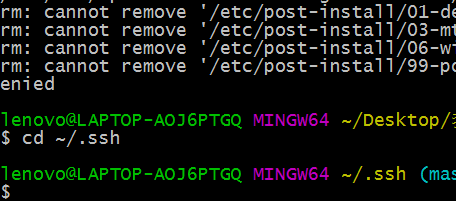
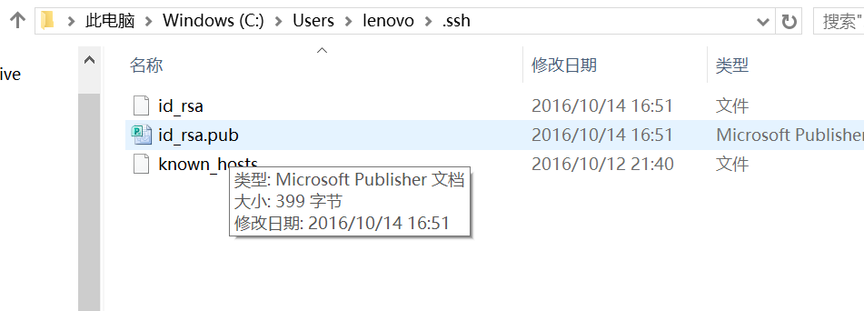
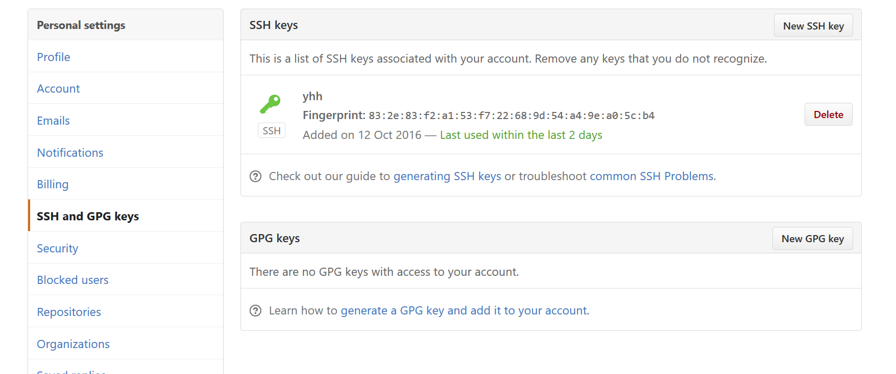

# github
[[toc]]

```js
…or create a new repository on the command line
echo "# popu" >> README.md
git init
git add README.md
git commit -m "first commit"
git remote add origin https://github.com/qiufeihong2018/popu.git
git push -u origin master


…or push an existing repository from the command line
git remote add origin https://github.com/qiufeihong2018/popu.git
git push -u origin master
…or import code from another repository
You can initialize this repository with code from a Subversion, Mercurial, or TFS project.
Import code
```

我每天使用 `Git` ，但是很多命令记不住。
一般来说，日常使用只要记住下图 `6` 个命令，就可以了。但是熟练使用，恐怕要记住60～100个命令。

下面是我整理的常用 Git 命令清单。几个专用名词的译名如下。
Workspace：工作区
Index / Stage：暂存区
Repository：仓库区（或本地仓库）
Remote：远程仓库
## 新建代码库

```js
# 在当前目录新建一个Git代码库
$ git init

# 新建一个目录，将其初始化为Git代码库
$ git init [project-name]

# 下载一个项目和它的整个代码历史
$ git clone [url]
```

## 配置
Git的设置文件为.gitconfig，它可以在用户主目录下（全局配置），也可以在项目目录下（项目配置）。

```js
# 显示当前的Git配置
$ git config --list

# 编辑Git配置文件
$ git config -e [--global]

# 设置提交代码时的用户信息
$ git config [--global] user.name "[name]"
$ git config [--global] user.email "[email address]"
```

## 增加/删除文件

```js
# 添加指定文件到暂存区
$ git add [file1] [file2] ...

# 添加指定目录到暂存区，包括子目录
$ git add [dir]

# 添加当前目录的所有文件到暂存区
$ git add .

# 添加每个变化前，都会要求确认
# 对于同一个文件的多处变化，可以实现分次提交
$ git add -p

# 删除工作区文件，并且将这次删除放入暂存区
$ git rm [file1] [file2] ...

# 停止追踪指定文件，但该文件会保留在工作区
$ git rm --cached [file]

# 改名文件，并且将这个改名放入暂存区
$ git mv [file-original] [file-renamed]
```

## 代码提交

```js
# 提交暂存区到仓库区
$ git commit -m [message]

# 提交暂存区的指定文件到仓库区
$ git commit [file1] [file2] ... -m [message]

# 提交工作区自上次commit之后的变化，直接到仓库区
$ git commit -a

# 提交时显示所有diff信息
$ git commit -v

# 使用一次新的commit，替代上一次提交
# 如果代码没有任何新变化，则用来改写上一次commit的提交信息
$ git commit --amend -m [message]

# 重做上一次commit，并包括指定文件的新变化
$ git commit --amend [file1] [file2] ...

```

## 分支
```js
git 本地分支与远程分支
github上已经有master分支 和dev分支
在本地
git checkout -b dev 新建并切换到本地dev分支
git pull origin dev 本地分支与远程分支相关联
在本地新建分支并推送到远程
git checkout -b test
git push origin test   这样远程仓库中也就创建了一个test分支

# 列出所有本地分支
$ git branch

# 列出所有远程分支
$ git branch -r

# 列出所有本地分支和远程分支
$ git branch -a

# 新建一个分支，但依然停留在当前分支
$ git branch [branch-name]

# 新建一个分支，并切换到该分支
$ git checkout -b [branch]

# 新建一个分支，指向指定commit
$ git branch [branch] [commit]

# 新建一个分支，与指定的远程分支建立追踪关系
$ git branch --track [branch] [remote-branch]

# 切换到指定分支，并更新工作区
$ git checkout [branch-name]

# 切换到上一个分支
$ git checkout -

# 建立追踪关系，在现有分支与指定的远程分支之间
$ git branch --set-upstream [branch] [remote-branch]

# 合并指定分支到当前分支
$ git merge [branch]

# 选择一个commit，合并进当前分支
$ git cherry-pick [commit]

# 删除分支
$ git branch -d [branch-name]


# 删除远程分支
$ git push origin --delete [branch-name]
$ git branch -dr [remote/branch]
```

## 标签

```js
# 列出所有tag
$ git tag

# 新建一个tag在当前commit
$ git tag [tag]

# 新建一个tag在指定commit
$ git tag [tag] [commit]

# 删除本地tag
$ git tag -d [tag]

# 删除远程tag
$ git push origin :refs/tags/[tagName]

# 查看tag信息
$ git show [tag]

# 提交指定tag
$ git push [remote] [tag]

# 提交所有tag
$ git push [remote] --tags

# 新建一个分支，指向某个tag
$ git checkout -b [branch] [tag]
```

## 查看信息
```js
# 显示有变更的文件
$ git status

# 显示当前分支的版本历史
$ git log

# 显示commit历史，以及每次commit发生变更的文件
$ git log --stat

# 搜索提交历史，根据关键词
$ git log -S [keyword]

# 显示某个commit之后的所有变动，每个commit占据一行
$ git log [tag] HEAD --pretty=format:%s

# 显示某个commit之后的所有变动，其"提交说明"必须符合搜索条件
$ git log [tag] HEAD --grep feature

# 显示某个文件的版本历史，包括文件改名
$ git log --follow [file]
$ git whatchanged [file]

# 显示指定文件相关的每一次diff
$ git log -p [file]

# 显示过去5次提交
$ git log -5 --pretty --oneline

# 显示所有提交过的用户，按提交次数排序
$ git shortlog -sn

# 显示指定文件是什么人在什么时间修改过
$ git blame [file]

# 显示暂存区和工作区的差异
$ git diff

# 显示暂存区和上一个commit的差异
$ git diff --cached [file]

# 显示工作区与当前分支最新commit之间的差异
$ git diff HEAD

# 显示两次提交之间的差异
$ git diff [first-branch]...[second-branch]

# 显示今天你写了多少行代码
$ git diff --shortstat "@{0 day ago}"

# 显示某次提交的元数据和内容变化
$ git show [commit]

# 显示某次提交发生变化的文件
$ git show --name-only [commit]

# 显示某次提交时，某个文件的内容
$ git show [commit]:[filename]

# 显示当前分支的最近几次提交
$ git reflog

# 查看远程仓库，以及与本地仓库的关系
$ git remote show origin
```

## 远程同步

```js
# 下载远程仓库的所有变动
$ git fetch [remote]

# 显示所有远程仓库
$ git remote -v

# 显示某个远程仓库的信息
$ git remote show [remote]

# 增加一个新的远程仓库，并命名
$ git remote add [shortname] [url]

# 取回远程仓库的变化，并与本地分支合并
$ git pull [remote] [branch]

# 上传本地指定分支到远程仓库
$ git push [remote] [branch]

# 强行推送当前分支到远程仓库，即使有冲突
$ git push [remote] --force

# 推送所有分支到远程仓库
$ git push [remote] --all
```

## 撤销

```js
# 恢复暂存区的指定文件到工作区
$ git checkout [file]

# 恢复某个commit的指定文件到暂存区和工作区
$ git checkout [commit] [file]

# 恢复暂存区的所有文件到工作区
$ git checkout .

# 重置暂存区的指定文件，与上一次commit保持一致，但工作区不变
$ git reset [file]

# 重置暂存区与工作区，与上一次commit保持一致
$ git reset --hard

# 重置当前分支的指针为指定commit，同时重置暂存区，但工作区不变
$ git reset [commit]

# 重置当前分支的HEAD为指定commit，同时重置暂存区和工作区，与指定commit一致
$ git reset --hard [commit]

# 重置当前HEAD为指定commit，但保持暂存区和工作区不变
$ git reset --keep [commit]

# 新建一个commit，用来撤销指定commit
# 后者的所有变化都将被前者抵消，并且应用到当前分支
$ git revert [commit]

# 暂时将未提交的变化移除，稍后再移入
$ git stash
$ git stash pop
```

## 其他

```js
# 生成一个可供发布的压缩包
$ git archive
```

## 问题

### git中本地与远程库的关联与取消
```js
# 在本地目录下关联远程repository
$ git remote add origin git@github.com:git_username/repository_name.git
# 取消本地目录下关联的远程库
$ git remote remove origin
```

### git本地给远程仓库创建分支
必须先在本地创建分支然后将该分支push到远程仓库
```js
git branch dev
git push origin dev
```


### github平台如何回退代码到历史指定版本
github平台如何回退代码到历史指定版本

前提是 本地已经有了 git的origin master库
或者克隆需要回退的代码到本地

1.  查询历史对应不同版本的ID ，用于回退使用
```
$ git log --pretty=oneline
```

使用git log命令查看所有的历史版本，获取你git的某个历史版本的id
       假设查到历史版本的id是fae6966548e3ae76cfa7f38a461c438cf75ba965。
2. 恢复到历史版本
```
$ git reset --hard fae6966548e3ae76cfa7f38a461c438cf75ba965
```


3. 把修改推到远程服务器，-f代表--force，-u默认机子，后面无需加参数使用git push
```
$ git push -f -u origin master
```

4. 重新更新就可以了
```
git pull
```

### Host key verification failed.
```
@@@@@@@@@@@@@@@@@@@@@@@@@@@@@@@@@@@@@@@@@@@@@@@@@@@@@@@@@@@
@    WARNING: REMOTE HOST IDENTIFICATION HAS CHANGED!     @
@@@@@@@@@@@@@@@@@@@@@@@@@@@@@@@@@@@@@@@@@@@@@@@@@@@@@@@@@@@
IT IS POSSIBLE THAT SOMEONE IS DOING SOMETHING NASTY!
Someone could be eavesdropping on you right now (man-in-the-middle attack)!
It is also possible that a host key has just been changed.
The fingerprint for the ECDSA key sent by the remote host is
SHA256:XfRhNYJub0IjykGB+4RanL6i1hlYkfvkq1Qj53ySoxA.
Please contact your system administrator.
Add correct host key in /home/devue/.ssh/known_hosts to get rid of this message.
Offending ECDSA key in /home/devue/.ssh/known_hosts:2
  remove with:
  ssh-keygen -f "/home/devue/.ssh/known_hosts" -R 192.168.3.2
ECDSA host key for 192.168.3.2 has changed and you have requested strict checking.
Host key verification failed.
```

因为服务端重装系统,公钥不对了

删除客户端中保存的服务端的公钥

解决方法
```
rm -rf ~/.ssh/known_hosts
```
### git爬坑之gitclone权限问题
输入账号密码后提示 HTTP Basic: Access denied fatal: Authentication failed
[参考](https://www.cnblogs.com/VAllen/p/http-basic-access-denied-fatal-authentication-failed.html)

尝试使用这个命令后，用TortoiseGit拉取或推送项目，输入账号密码后，终于正常拉取和推送项目了。
```
git config --system --unset credential.helper
```

### You are not allowed to push code to protected branches on this project
[git合并分支成功，但是push失败(remote: GitLab: You are not allowed to push code to protected branches on this project.)](https://www.cnblogs.com/hcy-fly/p/9008323.html)


### Another git process semms to be running in this repository, e.g. an editor opene
```
Another git process semms to be running in this repository, e.g. an editor opened by ‘git commit’. Please make sure all processes are terminated then try again. If it still fails, a git process remove the file manually to continue.
```
大概意思就是说，当前已经有了一个编辑器打开了“git commit”指令，请关闭所有git相关的进程重试，否则，请手动删除那个文件。

### 一次输入用户名密码永久不需要
```
git config --global credential.helper store
```
### 上传GitHub怎么忽略node_modules
简单说就是在根目录下创建.gitignore，然后编辑过滤规则。
windows下怎么操作，方法如下：
1. 是常规的windows操作
> 根目录下创建gitignore.txt；

>编辑gitignore.txt，写下你的规则，例如加上node_modules/；

>打开命令行窗口，切换到根目录（可以直接在文件夹上面的地址栏输入cmd回车）；

>执行命令ren gitignore.txt .gitignore。

2. 是用Git Bash
>根目录下右键选择“Git Bash Here”进入bash命令窗口；


>输入vim .gitignore命令，打开文件（没有文件会自动创建）；

>按i键切换到编辑状态，输入规则，例如node_modules/，然后按Esc键退出编辑，输入:wq保存退出。

>git rm -r –cached .再push

其他类Linux环境的，直接打开命令窗口执行Git Bash的2,3步就行了。
最后.gitignore的过滤规则是什么，说明如下：
```
node_modules/   表示过滤这个文件夹
*.zip   过滤zip后缀文件
demo.html   过滤该文件
负面清单：设置哪些文件不被过滤
!src/   跟踪该文件夹
!*.js   跟踪java源文件
!index.html 跟踪该文件
```


### Github在readme添加gif图
[Github在readme添加gif图](https://www.jianshu.com/p/3142755e93c8)

### Git 修改已提交的commit注释
#### 修改最后一次注释
如果你只想修改最后一次注释
```
git commit --amend
```
出现有注释的界面（你的注释应该显示在第一行）， 输入i进入修改模式，修改好注释后，按Esc键 退出编辑模式，输入:wq保存并退出。ok，修改完成。

#### 修改之前的某次注释

```
git rebase -i HEAD~2
```
最后的数字2指的是显示到倒数第几次 比如这个输入的2就会显示倒数的两次注释（最上面两行）

你想修改哪条注释 就把哪条注释前面的pick换成edit。方法就是上面说的编辑方式：i---编辑，把pick换成edit---Esc---:wq.
然后：（接下来的步骤Terminal会提示）
git commit --amend

修改注释，保存并退出后，输入：
git rebase --continue

其实这个原理我的理解就是先版本回退到你想修改的某次版本，然后修改当前的commit注释，然后再回到本地最新的版本

### 出现冲突后怎么办?
```
git merge 指定分支后
出现冲突
改变冲突后
git add -u
git push即可。
```
### github和gitlab ssh_key怎么配置
步骤
1. 输入cd ~/.ssh——回车（看你是否有了ssh key 密钥，有了就备份）；

2. 输入ssh-keygen -t rsa -C "your email"——直接回车，之后会让你输入github的账号密码，会出现如图所示结果，跟着上面所指示的路径，在你的电脑中找到该文件，id_rsa文件即是你的私有密钥，id_rsa.pub是共开密钥


3. 打开你的id_rsa.pub文件，复制下里面的内容，然后登录进去你的github；


4. 在右上角账户那里点击头像边上的下拉，出现如图——点击settings进去，找到左侧的SSH Keys,点击，如图；




5. 在点击Add SSH Key，在title处填入任意的标识，在Key部分里面添加刚才复制的id_rsa.pub文件里的内容，点击添加即可；


6. 添加成功


7. 最后一步了，只需测试一下链接是否正常了，接着输入：ssh -T git@github.com，


这样，我们的 `git` 配置就完成了。

#### 配置另一个id_rsa
key默认位置是id_rsa
我现在要配置的是id_rsa_compony与第一个区分开来,之后的操作同上

::: tip
git不需要密码

Enter passphrase (empty for no passphrase)

Enter file in which to save the key 为空的话，创建的就是空的


:::

### github页面内容过长消失

如下图，第一张是vscode中的10000多行内容的截图，第二张是github从那一行消失的截图


### git push报错：OpenSSL SSL_connect: Connection was reset in connection to github.com:443
因为 `Git` 的 `Http` 代理的问题， `Git` 支持三种协议：`git://`、 `ssh://` 和 `http://` ，本来 `push` 的时候应该走 `ssh` 隧道的，但是因为设置了 `http` 代理，所以就走了 `http` 的代理，于是就提交不了了。

- 方法一：
找到原因了，那就取消 `http` 代理吧:
```
git config --global --unset http.proxy
```
- 方法二：
```
git config --global http.sslVerify "false"
```
- 方法三：
如果这样都没有用，最后解决方案如下：
用记事本打开
```text
C:\Windows\System32\drivers\etc
```
中的 `hosts` 文件，加入 `github` 的 [`ip` 地址](https://www.ipaddress.com/)。
## 参考文献
[Git 修改已提交的commit注释](https://www.jianshu.com/p/098d85a58bf1)

[git小结](http://www.imooc.com/article/251132)


最后，别忘了给这个项目点一个star哦，谢谢支持。

[blog](https://github.com/qiufeihong2018/vuepress-blog)


一个学习编程技术的公众号。每天推送高质量的优秀博文、开源项目、实用工具、面试技巧、编程学习资源等等。目标是做到个人技术与公众号一起成长。欢迎大家关注，一起进步，走向全栈大佬的修炼之路

<style scoped>
    p:nth-last-child(2) {
        text-align: center
    }
</style>